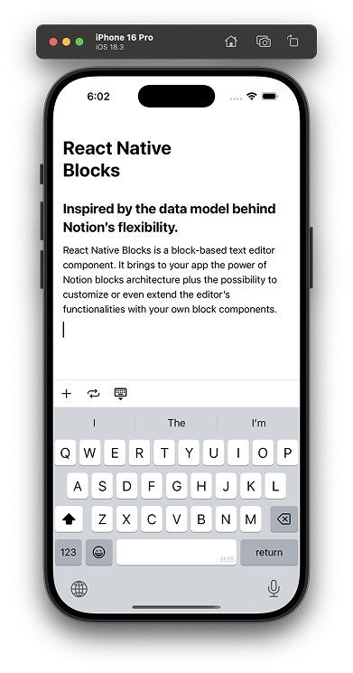

# React Native Blocks

A block based text editor fully built with react-native. Inspired by [the data model behind Notion’s flexibility.](https://www.notion.com/blog/data-model-behind-notion)

## Contributing

Feel free to contribute!

## Discord

Join me on Discord [https://discord.gg/utxtAafD8n](https://discord.gg/utxtAafD8n)

## Disclaimer

This project is an independent open-source initiative and is **not affiliated with, endorsed by, or connected to Notion Labs, Inc.** in any way.

All trademarks, logos, and brand names used in this project are the property of their respective owners. Any references to “Notion” are for **descriptive or comparative purposes only** and do not imply any association or partnership.

