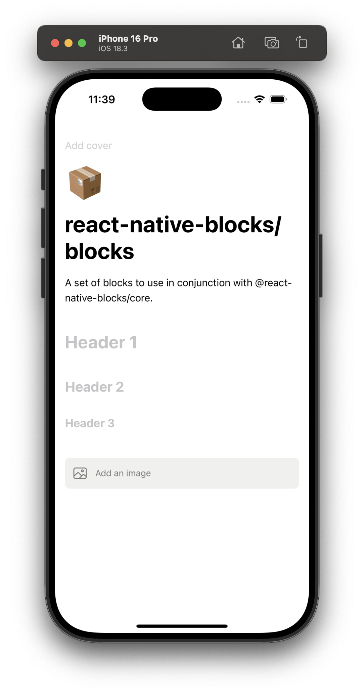

# @react-native-blocks/blocks

A set of block components to use in conjunction [@react-native-blocks/core](https://www.npmjs.com/package/@react-native-blocks/core) library. Provides the necessary blocks to build a Notion-like text editor.



## Installation
Remember this library it's meant ti be used with `@react-native-blocks/core`.
```
npm install @react-native-blocks/blocks
```

## Block types

- Text
- Header 1
- Header 2
- Header 3
- To-do list
- Bulleted list
- Numbered list
- Callout
- Quote
- Image

## Warning
This library is still a work in progress so expect breaking changes on future releases. If you have any doubts you can join our [Discord server](https://discord.gg/utxtAafD8n).


